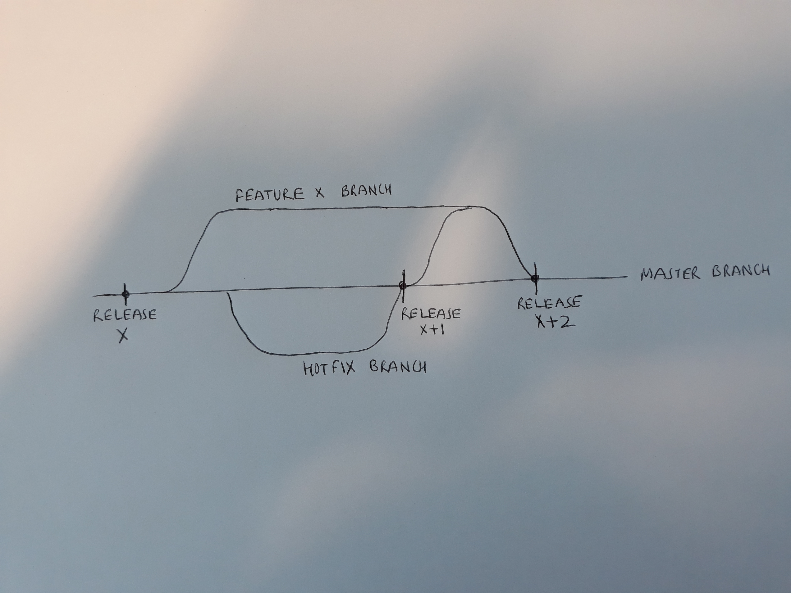

#**Guideline on Best Practices**

## **What is best practice & why ?**

A set of consistent working methods that are based on proven industrial practices in the area and are tailored as per the project needs.  In design led-agile delivery with focus on DevOps enablement and automation, consistent best practices help to achieve -

- A regular pattern of working by all the team member to re-use practices and gain efficiencies
- Required mandatory data capture through use of practices using tools to automate reports and build knowledge base. No manual tweaking in creating the reports required by different stakeholders. For more info check the link Role & Report matrix 
- A consistent practice will help integrating other DevOps tools to achieve end-to-end automations

Following areas of best practices will help to ensure team remained focused on the backlog and innovations as per their project roles - 

>> - [**Work Management** ](/Best-Practices/Work-Hub)
         1. Story should be defined in a way to deliver a functionality that end users can understand, test and provide sign-off
         2. All communication related to a story or task must be via VSTS discussions module. Use reference of task or story in the communication. The communication is integrated with Slack for integrated communications
        3. High level backlog is defined as Epics, refined to Features. All features are then broken down to Stories (that user can validate and test) and tasks (that technical team can understand and work-on
        4. Branch and Release must be associated with a work item (Story and Task)
>> - [**Version Control Management**](https://docs.microsoft.com/en-us/vsts/git/tutorial/gitworkflow?view=vsts)
        1. Branching Policies must be used when working on features and operational issues to ensure operational issues are addressed at a faster pace
*Branches to use* 
-Master
-Hot Fix
-Feature

The policies to be re-visited after PaaS migration
>> - [**Build Management**](https://docs.microsoft.com/en-us/vsts/build-release/actions/ci-cd-part-1?view=vsts)
        1. Automated test cases must be included in the build step
>> - [**Release Management**](https://docs.microsoft.com/en-us/vsts/build-release/actions/define-multistage-release-process?view=vsts)
        1. Automated regression testing to be plugged in (Selenium) at Release Workflow Stage to test the application for various browser
>> - [**Operations Management**](https://docs.microsoft.com/en-us/azure/operations-management-suite/operations-management-suite-overview)
        1. Logs must be identified, captured and stored that will contain crucial data to build required management or compliance report at a later stage
>> - [**Proactive Monitoring**](https://docs.microsoft.com/en-us/azure/monitoring-and-diagnostics/monitoring-overview)
        1. Monitoring to be turned on at the server (Azure) or application side with logging enabled. Azure cloud monitoring services must be enabled 
>> - **Continuous Service Improvements**
        1. Everyone is encouraged to provide ideas and feedback on improved way of working. Aim is to track these ideas and check how many can be implemented
        2. Measurements to be enabled and tracked automatically  in everything we do
        3. All the useful information, knowledge articles and documents must be accessed through a single location

## **Team Guidelines**

While setting-up DevOps, it is important to follow certain Agile guidelines and discipline (which is classified as cultural & mindset change). Recommendations  –

1.	Participation from all team members is mandatory, stand-up call should not take more than 15 min
2.	Everything that team does on daily basis, must have a task associated (and correctly assigned) with it in VSTS that is linked to a story that have been committed to deliver in the Sprint (as agreed at the start of the sprint with stakeholders)
3.	Calendar add on is available in VSTS to track team's planned off-days – these should be used at the start of the sprint (in Sprint planning workshop)
4.	Any unplanned off day to be informed to the team manager
5.	Capture planned hrs at the start of the task and keep updating it on daily basis with remaining hrs and updated comments
6.	Use discussion field to discuss any technical details related to task or story. This will be used to build knowledge base for easy reference and troubleshooting the operational issues related to the feature

Before the start of the sprint – sprint planning is must where team must agree their commitments. 

###Sample Video Tutorials (Test only)

<html><iframe width="560" height="315" src="https://www.youtube.com/embed/pgz3Ua-I8UM?rel=0&amp;showinfo=0" frameborder="0" allow="autoplay; encrypted-media" allowfullscreen></iframe></html>

<video width="320" height="240" controls>
  <source src="https://www.youtube.com/watch?v=KgWRzjwiXP8" >
</video>
<video src="<https://www.youtube.com/embed/Vj7DmdO4-Fg?rel=0>" width=400 controls allowfullscreen>
</video>

[Play video from YouTube](https://www.youtube.com/embed/Vj7DmdO4-Fg?rel=0)

