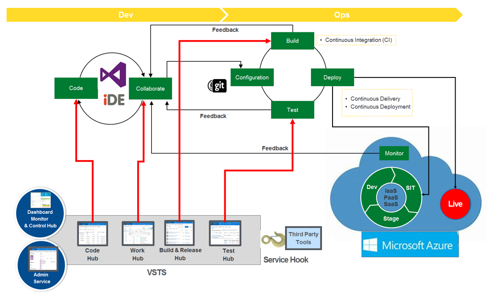
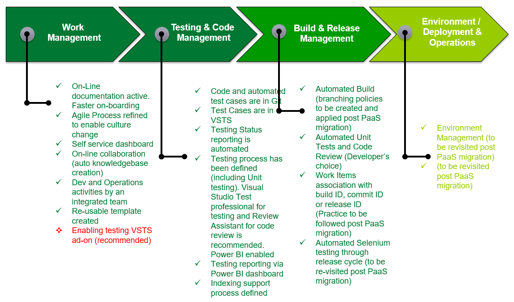

#**DemoSearch - DevOps enablement journey**

## **DevOps - Considerations**
---

- **Policy** - Plays a key role in securing Organisational commitment and provide guidance to service provider to operate the services as per compliance requirements (e.g. Security Policy / Data Protection policy etc)
- **Culture** - It includes different ways to working, more collaboration, re-usable information  generated through discussions that will help in building knowledge articles automatically
- **Tooling** - Selection of right tools for specific task orchestration & automation. VSTS is being used as end-to-end orchestration tool supported by add-ons and tools as below -
>> **Add-ons used with VSTS for Automation** 
-Excel export - Integration with Excel
-Visualizer - Trace link between Work Items (Epic / Feature / Story & Tasks) (Awaited)
-Team Calendar - Automated capacity calculations per Sprint
-Analytics (for Power BI integration)
-Test Manager - to manage automated test plans (Awaited)
-Visual Studio 2017 - IDE for code and test case development 
-Power BI - for Stakeholder Dashboards
-Azure PaaS - as platform
>>
- **Configuration** - Tools should be configured for right level of integration with secured and authenticated access
- **Workflow** - Required to create gateways for manual intervention and approvals between stages (QA)

## **DevOps - Model - using VSTS**
---

 *Test Plan Approach*

1. Unit testing - Developers can configure their development environment for Auto unit testing as per the programming language they use. (e.g. Mocha for Node.js) (No defined Guidelines)

2. All "End User" "value creating" deliverables are included in Stories. A Sprint includes number of stories that will be delivered

3. Integration / Functional / End-to-end and Regression testing will be carried out using a single plan extracted from VSTS. (Recommended tool to carry out automatically is Test Manager add-on). In the mean time, following process to be followed -

          - Testing will be carried out for each Sprint (manual and automated test cases as in VSTS)
          - Test plan will include test cases to be executed for the stories to be delivered in that sprint. (This plan can be extracted from VSTS ) 
          - Tester must execute the test cases as per plan and update columns Test Date and Result. Any bugs to be raised in VSTS
4. Load testing and non-functional testing will be carried out using Azure services
5. Testing Process (Test Manager add-on will automate the steps as indicated) -
    - Extract Test Plan from VSTS into Excel file
   - Manually invoke tests (for Automated - invoke scripts, test data is still in testers local PC, for manual - run manual steps)
   - Excel has 3 additional columns (Test Date, Test Result & Remarks) that are to be updated with test results
   - Copy Excel File to Teams folder - [Link here](https://teams.microsoft.com/_#/files/General?threadId=19%3Afc2a9f232a634bbfba8e45201c10d0ca%40thread.skype&ctx=channel&context=Testing)
   - The Power BI dashboard will publish test results (sprint wise) based on the Excel data

**Types of releases**

- Planned release after each Sprint (for newly developed features) (In progress)
- Adhoc (as and when release for operational bug fixes 

Each type of release will have its own Test Plan and the scope of test plan depends on type of release. Test Manager add-on will be used to automatically cover all test cases applicable as per Story list for release. Different types of tailored plans -

- Detailed Plan
- Feature Specific Plan
- Tailored Plan

Test Environment (using application's golden image) to execute above plans will be created as per Environment Build automation. It should be fit for -
- Functional Testing
- Integration Testing
- End-to-end Testing
- Regression Testing
- Load / Non-Functional testing (if possible)

Associate automated test case (method) with Manual test case in VSTS (need enterprise edition of Visual Studio). Use Visual Studio Enterprise, Visual Studio Professional, or Visual Studio Test Professional to associate the automated test with a test case. (In progress - can be enabled with Test Manager add-on)

*Code Management & Release Approach*

All the code is in VSTS git repository. Please use [link](https://digitalfoundations.visualstudio.com/Upstream_Technology_SmartSearch_Process/_git/SmartSearchCode) to clone code to your local workstation for any code modification and commits. 

**Environments**

Three environments in use (all are PaaS in Azure - managed by third party)

- Development
- Staging
- Production

Guideline to make all the environments fit for purpose of testing is as given below -

1. Ensure no hardcoding of environment links in the code 
2. All the developers to check/update the DB connection string locally and verify their changes only in DEV URL

*Environment Status as of May 2018*

Environment usage and set-up process to be re-visited after PaaS migration.

|                    | Development (called Test Environment)         | Staging (UAT) |Production   
|-----------            |:------------|:------------|:---------------
| URL                | [Development](https://smartsearch-tst.bpweb.bp.com) | [UAT](https://smartsearch-stg.bpweb.bp.com)|[Production](https://smartsearch.bpweb.bp.com)
Fit for Development               | Yes    | Yes | Yes
Fit for Testing              | Yes    | Yes | Yes
VSTS Pipeline Integration              | Yes    | Yes | Yes
Approval Workflow (for deployment)              | No    | No | No
PaaS             | In progress    | In progress | In progress
Database - fit for purpose              | Yes (Refresh activity is manual, developers to use correct link)    | Yes (Refresh activity is manual, developers to use correct link) | Yes
Voyager Equivalent Environment             | No    | No | Yes

**Third Party Dependency** 

The team is dependent on core search product (current version - 1.9.12.5) provided by third party. Other key activities associated with the operations are as below -

- Indexing
- Configuration
- Installation
- Upgrades
- Troubleshooting 

 
## **DevOps - Status**
---

## **DevOps - Live Demo (Click links below to check the set-up)**
---
- [**Team Dashboard**](https://digitalfoundations.visualstudio.com/Upstream_Technology_SmartSearch_Process/Upstream_Technology_SmartSearch_Process%20Team/_dashboards/Upstream_Technology_SmartSearch_Process%20Team/c243f9d9-7484-4911-80fc-d6e773ab989a)
- [**Stakeholders Dashboard**](https://app.powerbi.com/groups/me/reports/219c2f45-d340-42ef-b2df-2ad63bbcaa58?ctid=ea80952e-a476-42d4-aaf4-5457852b0f7e)
- [**Agile Board**](https://digitalfoundations.visualstudio.com/Upstream_Technology_SmartSearch_Process/_backlogs/taskboard/Upstream_Technology_SmartSearch_Process%5CSprint%20-%203?_a=requirements)

Last Update: 22May2018