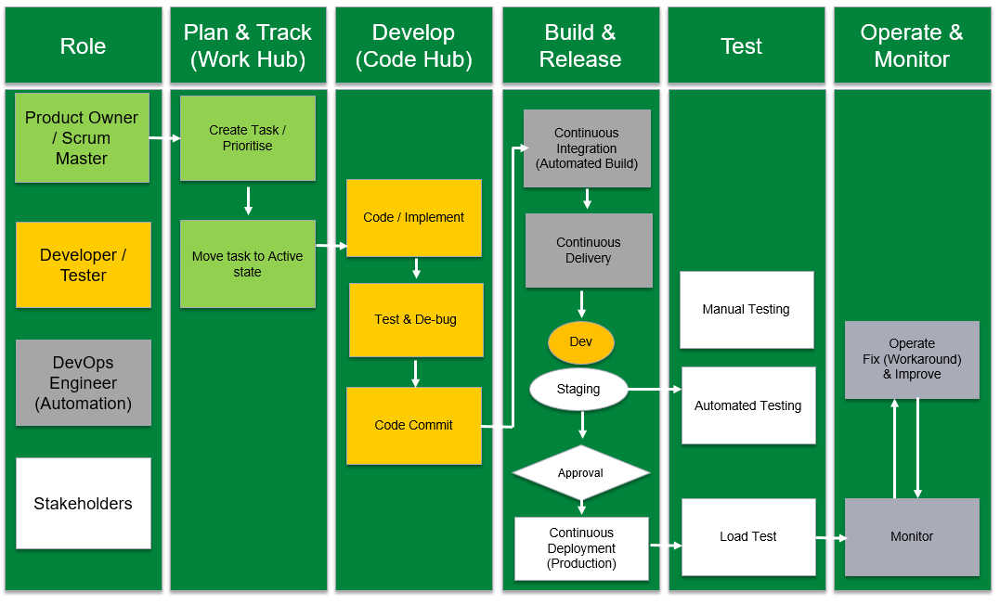

# **VSTS Tool is used to set-up DevOps** 

VSTS provides end-to-end ALM functionality using various hubs as listed below -

- **Code Hub** - provides functions for source control Git-based or TFVC repositories to support version control of the software projects. These repositories are private. Following functionalities is provided by Code Hub -
• Review, download, and edit files and review the change history for a file 
• Review and manage commits that have been pushed 
• Review, create, approve, comment, and complete pull requests 
• Add and manage Git tags 

- **Work Hub** - Provides Agile tools to support for planning and tracking work. Following functionalities is provided by Work Hub -
• Add and update work items 
• Define work item queries and create status and trend charts based on those queries 
• Manage your product backlog 
• Plan sprints using sprint backlogs 
• Review sprint tasks and update tasks through the task boards 
• Visualize the work flow and update status using Kanban boards 
• Manage portfolios by grouping stories under features and features under epics
 
- **Build & Release Hub** - Provides an integrated set of features to support building and deploying the applications. We are using this hub to implement continuous integration and continuous delivery. Following functionalities is provided by Build & Release Hub -
• Build automation: Define the steps to take during build and the triggers that will initiate a build. 
• Release management: Supports a rapid release cadence and management of simultaneous releases. Release definitions can be configured representing the environments from development to production. Run automations to deploy the application to each environment. Add approvers to sign off that the application has been successfully deployed in an environment. Create release manually or automatically from a build. Then track the releases as they are deployed to various environments.

- **Test Hub** - Test Hub support manual and exploratory testing, load or performance testing, and continuous testing.  Following functionalities is provided by Test Hub -
• Customization of workflows with test plan, test suite and test case work items 
• End-to-end traceability from requirements to test cases and bugs with requirement-based test suites 
• Criteria-based test selection with query-based test suites 
• Excel-like interface with the grid for easy test case creation 
• Reusable test steps and test data with shared steps and shared parameters 
• Sharable test plans, test suites and test cases for reviewing with stakeholders 
• Browser-based test execution on any platform 
• Real-time charts for tracking test activity.

##**SmartSearch Roles interacting with VSTS Hubs -**

###**Standard Project Roles -**

[Role and VSTS Permission Set-up Matrix](.attachments/SmartSearch-Matrix_v1-59009fd8-58b4-4658-a167-5d6b24bfecb3.xlsx)

- Scrum Master
- DevOps Manager
- Stakeholder (Read Only) – BP Program Manager / Service Owner / Architect 
- Product Owner
- Developer / Tester
- DevOps - Engineer

###**Roles & Responsibilities**

_DevOps - Developer (Agile) / Tester_
- Develop application using Visual Studio 
- Version Control Code using Git or TFVC repository hosted in VSTS
- Use IDE, view repositories, check history, and collaborate
- Test the application
**Details are configured in VSTS permission set-up

_DevOps - Engineers_
- Responsible for automated builds, CI and CD
- Package builds
- Define Policies (Brancing Policies)
- Run automated tests with the builds
- Define, manage & track deployments
- Get approvals for deployment (stage wise) from QA team
- Enable deployment of applications to Azure environments
- Manage dependencies (Third Party and Vendors)
- Team admin and Project admin services
**Details are configured in VSTS permission set-up

_Stakeholders_
- Check project progress
- Provide feedback
- Provide inputs for business innovation & ideas
- Approvals / agreements

_Scrum Master_
- Work with Product Owner to plan, priorities, and tracking the status of work, code defects, and customer issues
- using Agile tools. All work is captured within a work item. Each work item represents a specific type such as a user story, task, or bug
- Use the sprint backlog and task board to implement Scrum practices
- Use the Kanban board to work with Kanban methods
- Use queries to list and update work items, create status and trend charts, and post charts to dashboards
- Use dashboards to share information, status, and trends with your team or organization

###**Role & Report Matrix**
Tells which report is applicable for which report and enabled accordingly

**Project Access**
- BP Induction - email / pass / NTID - Contact Project Manager
- How to get VSTS access? - Contact Administrator
- Get access for Slack & MS Teams. Contact Project Manager
- [How to raise IT help desk tickets](https://myit.bpglobal.com/MyRequests/Requests)
- [Get Visual Studio installed on your PC](https://desksupport.wipro.com)
